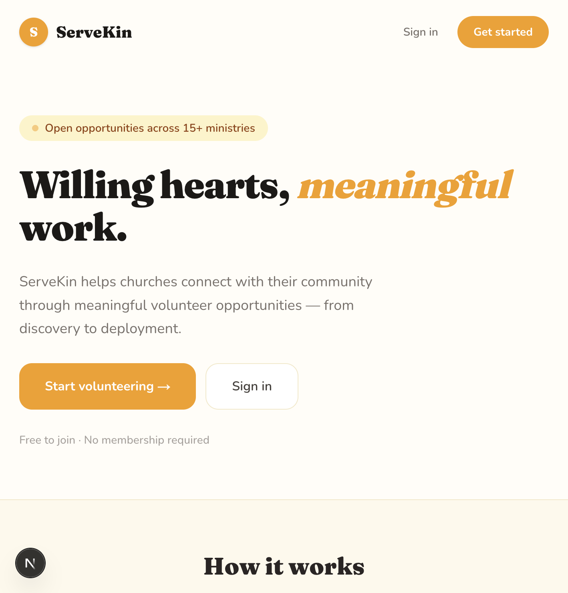

# Landing Page — 2026-06-06

## What changed
Initial build of the ServeKin landing page. Established full design system: warm citrus palette (saffron/amber primary, coral accent, cream backgrounds), Fraunces display font paired with Nunito for body text. Page includes nav, hero with decorative ministry card preview, "How it works" feature strip, CTA banner, and footer.

## Screenshot

