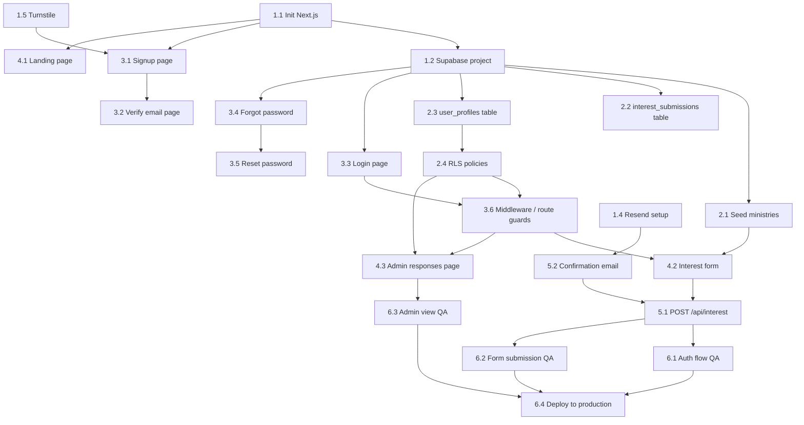

# ServeKin — Phase 0 Task List

## Overview

Phase 0 goal: A live site where church goers can create an account, submit ministry interest, and receive a confirmation email. Eight pages, one form, one admin view.

---

## Track 1 — Project Setup & Infrastructure

- **Task 1.1** — Initialize Next.js project with TypeScript and Tailwind CSS
  - Skill: Next.js CLI, Tailwind CSS config
  - Command: `npx create-next-app@latest servekin --typescript --tailwind --app`

- **Task 1.2** — Create Supabase project, copy API keys to `.env.local`
  - Skill: Supabase dashboard, environment variables in Next.js

- **Task 1.3** — Connect GitHub repo to Vercel for auto-deploy
  - Skill: Vercel dashboard, GitHub integration, environment variable configuration in Vercel

- **Task 1.4** — Create Resend account, verify sending domain
  - Skill: Resend dashboard, DNS records (SPF/DKIM for email deliverability)

- **Task 1.5** — Register Cloudflare Turnstile site key for the signup form
  - Skill: Cloudflare dashboard, Turnstile widget setup

---

## Track 2 — Database Schema

- **Task 2.1** — Create `ministries` table and seed with initial ministry list
  - Skill: Supabase SQL editor, PostgreSQL

- **Task 2.2** — Create `interest_submissions` table (user_id, ministry_ids[], notes, created_at)
  - Skill: Supabase SQL editor, PostgreSQL

- **Task 2.3** — Add `role` column to `auth.users` via a `user_profiles` table
  - Skill: Supabase Row Level Security (RLS), PostgreSQL foreign keys

- **Task 2.4** — Write RLS policies: volunteers can only read/write their own submissions; admin can read all
  - Skill: Supabase RLS policies, PostgreSQL policy syntax

---

## Track 3 — Authentication Pages

- **Task 3.1** — Build `/signup` page with Supabase Auth `signUp()` + Turnstile widget
  - Skill: Supabase Auth JS client, React form handling, Cloudflare Turnstile React component

- **Task 3.2** — Build `/verify-email` page (static prompt to check inbox, no logic needed)
  - Skill: Next.js App Router, Tailwind CSS

- **Task 3.3** — Build `/login` page with Supabase Auth `signInWithPassword()`
  - Skill: Supabase Auth JS client, React form handling

- **Task 3.4** — Build `/forgot-password` page with Supabase Auth `resetPasswordForEmail()`
  - Skill: Supabase Auth JS client

- **Task 3.5** — Build `/reset-password` page with Supabase Auth `updateUser()`
  - Skill: Supabase Auth JS client, Next.js dynamic route params

- **Task 3.6** — Add Next.js middleware to protect `/interest` and `/admin/*` routes — redirect unauthenticated users to `/login`
  - Skill: Next.js `middleware.ts`, Supabase server-side auth helpers (`@supabase/ssr`)

---

## Track 4 — Core Pages & UI

- **Task 4.1** — Build `/` landing page: hero section with mission statement, sign-up CTA button, basic branding
  - Skill: Tailwind CSS, Next.js App Router, component composition
  - Reference: Mission statement — *"ServeKin is a volunteering platform built for churches — helping ministries connect with their community, fill meaningful roles, and grow a culture of service."*

- **Task 4.2** — Build `/interest` form page: multi-select for 1–5 ministries (fetched from DB), optional "about me" textarea, submit button
  - Skill: React state management, Supabase client query (`select * from ministries`), form validation

- **Task 4.3** — Build `/admin/interest-responses` page: protected table showing name, email, ministry selections, submission date; paginated
  - Skill: Supabase server-side data fetching, Next.js server components, Tailwind CSS table

---

## Track 5 — Backend / API

- **Task 5.1** — Create `POST /api/interest` API route: validate input, insert into `interest_submissions`, trigger confirmation email
  - Skill: Next.js API routes (Route Handlers), Supabase server client, input validation (Zod recommended)

- **Task 5.2** — Wire Resend to send volunteer confirmation email on interest submission
  - Skill: Resend SDK (`resend.emails.send()`), HTML email template

- **Task 5.3** — Add admin role guard to `/admin/*` — server-side check that user has `admin` role, return 403 or redirect otherwise
  - Skill: Next.js middleware or server component auth check, Supabase RLS

---

## Track 6 — Testing & Launch

- **Task 6.1** — End-to-end test all auth flows: sign up → verify email → login → forgot password → reset
  - Skill: Manual QA; optionally Playwright for automated testing

- **Task 6.2** — Test interest form: submit → confirm DB record created → confirm email received
  - Skill: Supabase table editor, Resend logs dashboard

- **Task 6.3** — Test admin view: log in as admin role user → confirm `/admin/interest-responses` loads with data
  - Skill: Supabase Auth, browser DevTools

- **Task 6.4** — Deploy to Vercel production, set all environment variables, smoke test live URL
  - Skill: Vercel dashboard, environment variables, DNS (if using custom domain)

---

## Dependency Order

---

## Key Skills Summary

| Skill Area | Used In |
|---|---|
| Next.js App Router + Middleware | Tasks 1.1, 3.6, 4.1, 4.2, 4.3, 5.1 |
| Supabase Auth JS client | Tasks 3.1, 3.3, 3.4, 3.5 |
| Supabase server-side (`@supabase/ssr`) | Tasks 3.6, 4.3, 5.3 |
| PostgreSQL + Supabase RLS | Tasks 2.1–2.4 |
| Tailwind CSS | Tasks 3.2, 4.1, 4.2, 4.3 |
| Resend SDK | Task 5.2 |
| Cloudflare Turnstile | Tasks 1.5, 3.1 |
| Zod (input validation) | Task 5.1 |
| Vercel deployment | Tasks 1.3, 6.4 |
